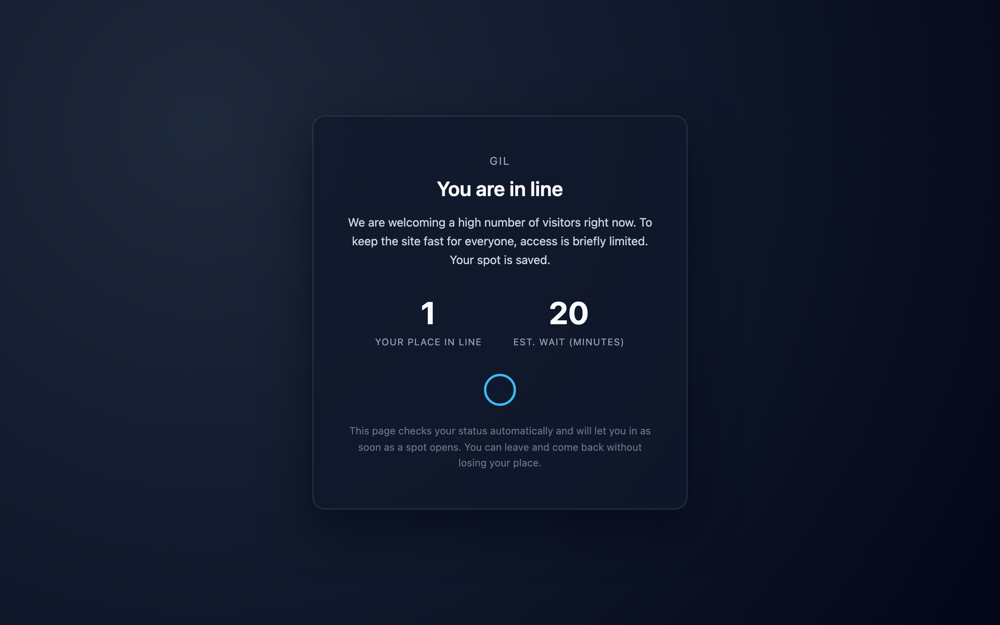
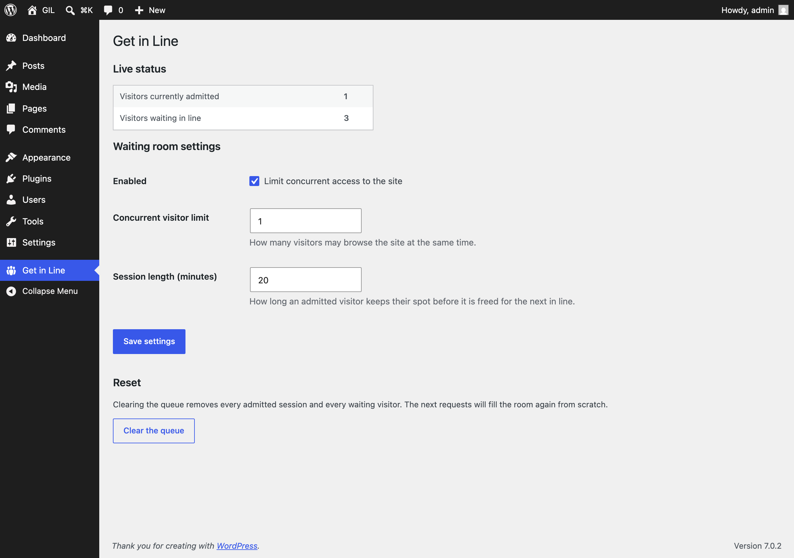
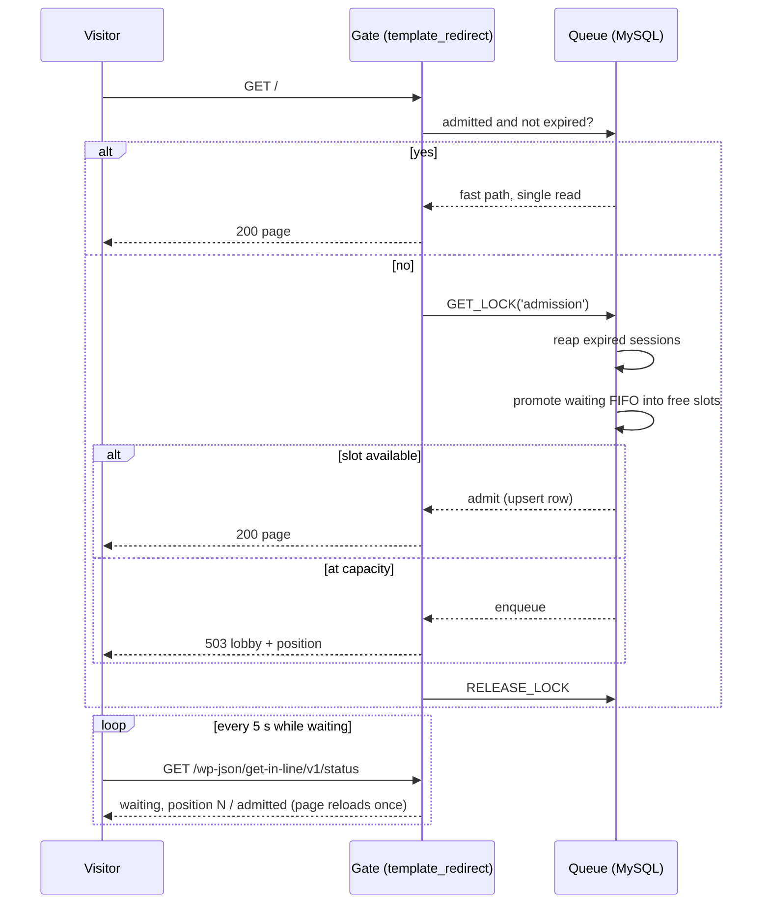

# Get in Line

A virtual waiting room for WordPress. When traffic exceeds what your server can comfortably handle, Get in Line caps how many visitors browse at once and places everyone else in a fair, first-come-first-served queue with live position updates and automatic admission.

[](https://github.com/mateusgetulio/GIL/actions/workflows/ci.yml)





## What it does

- Caps concurrent front-end visitors at a limit you configure; everyone else waits in a FIFO queue.
- Visitors keep their place in line across reloads and short absences via a signed, HttpOnly cookie. No PHP sessions.
- The lobby polls a REST status endpoint every 5 seconds and admits the visitor automatically the moment a spot opens.
- The lobby is served with HTTP 503 and `Retry-After`, so search engines understand the site is temporarily busy and never index the queue page.
- Administrators are never gated, so you cannot lock yourself out.
- Live admitted/waiting counts and a nonce-protected queue reset on the settings page.

What it is not: DDoS protection. Requests still reach PHP; the plugin decides who may browse. It also cannot gate requests that a full-page cache or CDN answers without hitting WordPress.

## The interesting part: admission is atomic

A waiting room plugin has one job: the cap must hold. A naive `count rows, then insert` breaks under exactly the traffic spike the plugin exists for, because two concurrent requests both count N-1 and both admit. In v2, admission runs inside a MySQL named lock (`GET_LOCK`), which serializes the count-reap-promote-admit sequence across all PHP workers while keeping the steady-state path (an already-admitted visitor) a single indexed read:



If the lock cannot be acquired within its timeout, the visitor is queued rather than admitted: the design fails toward a correct cap, never past it.

The end-to-end suite proves this under load: 20 parallel fresh visitors against a limit of 5 must produce exactly 5 admitted rows and 15 queued, verified both at the HTTP layer and in the database.

## A case study in revisiting old code

I wrote v1 of this plugin in 2023, pre-AI-tooling, and submitted it to the WordPress.org directory. The review team pended it twice with a long list of legitimate findings, and the git history preserves that version on purpose. v1 had, among other things:

- A debug `return 'test12'` left in the identity function, which gave every visitor on Earth the same queue slot.
- A `CREATE TABLE` passed through `$wpdb->prepare()`, which quotes the table name and breaks activation on MySQL.
- Check-then-insert admission with no locking, so bursts overshot the cap. Ironic, for a concurrency plugin.
- A fatal `get_object_vars(null)` when the site was exactly at capacity.
- `session_start()` on every request, meaning any visitor could skip the queue by clearing cookies.

v2.0.0 is a ground-up rework: same product idea, new admission model, identity, request lifecycle, and tooling. The full defect-by-defect map is in [docs/SPEC.md](docs/SPEC.md), and the plan for resubmitting to WordPress.org, including a compliance table against every 2023 review finding, is in [docs/WPORG-SUBMISSION.md](docs/WPORG-SUBMISSION.md).

The rework also caught a bug the original never could have surfaced without tests: two visitors queuing within the same second received the same position, because `DATETIME` has one-second resolution and the position query had no tie-breaker. An e2e test found it on its first run; the fix orders by `(queued_at, id)`, the same total order promotion uses.

## Development

Requirements: Docker, Node 18+, PHP 7.4+, Composer.

```bash
npm install
composer install
npx playwright install chromium
npm run env:start          # WordPress at http://localhost:8888 (admin / password)
```

The plugin is mounted and activated automatically. A second, isolated instance runs at `http://localhost:8889` for the test suite.

```bash
npm run test:e2e           # Playwright end-to-end suite against :8889
npm run screenshots        # regenerates docs/screenshots/*.png
composer lint              # PHPCS, WordPress coding standards
```

### Test coverage

| Scenario | Where |
|---|---|
| Under the limit: no lobby, plain 200 | `tests/e2e/gate.spec.js` |
| Over the limit: 503, `Retry-After`, noindex, live position, identity stable across reloads | `tests/e2e/gate.spec.js` |
| Automatic FIFO promotion when a session expires, lobby self-admits | `tests/e2e/gate.spec.js` |
| Cap holds under a 20-parallel-visitor burst | `tests/e2e/concurrency.spec.js` |
| Administrators bypass the gate at capacity | `tests/e2e/admin-bypass.spec.js` |
| Settings save, server-side validation, live counts | `tests/e2e/settings.spec.js` |
| Nonce-protected queue clearing from the admin | `tests/e2e/clear-queue.spec.js` |

CI runs PHPCS and the full e2e suite (wp-env + Playwright) on every push.

## Roadmap

- Customizable lobby copy and colors from the settings page.
- A hook to end a session early (for example after checkout), returning the slot to the pool sooner.
- Crawler allowlist so search engine bots are never queued.
- Opt-in queue analytics: peak depth, average wait, admissions per hour.

## License

GPLv3. See [LICENSE](LICENSE).
